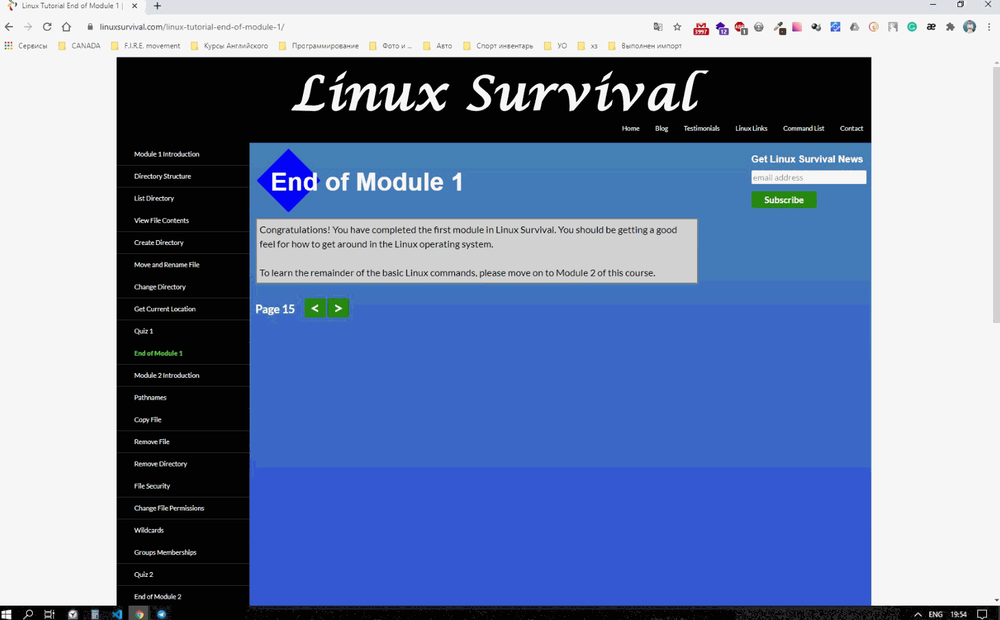
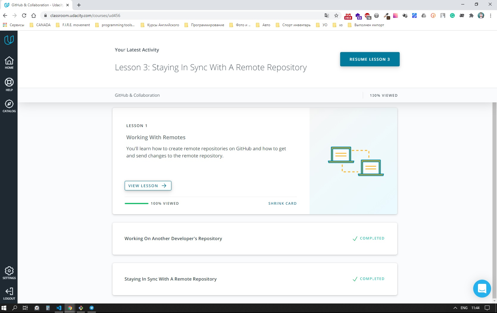
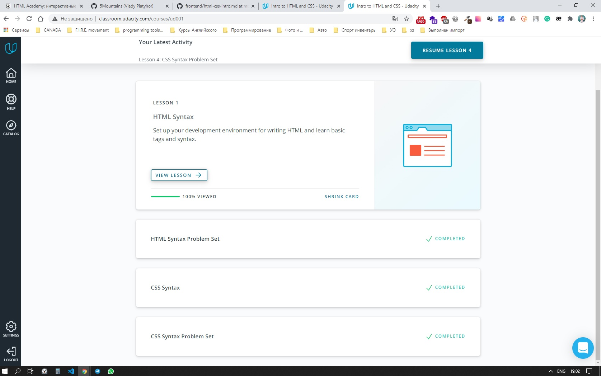
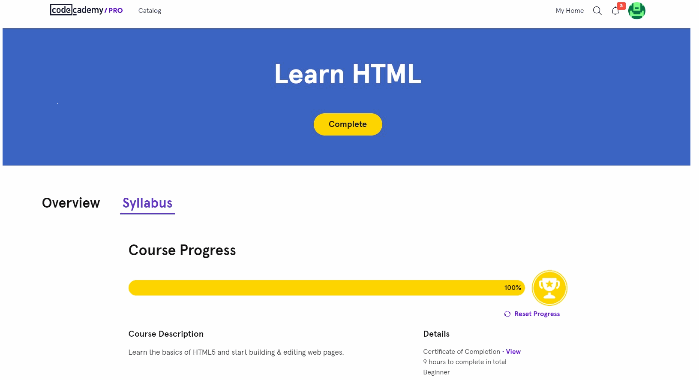
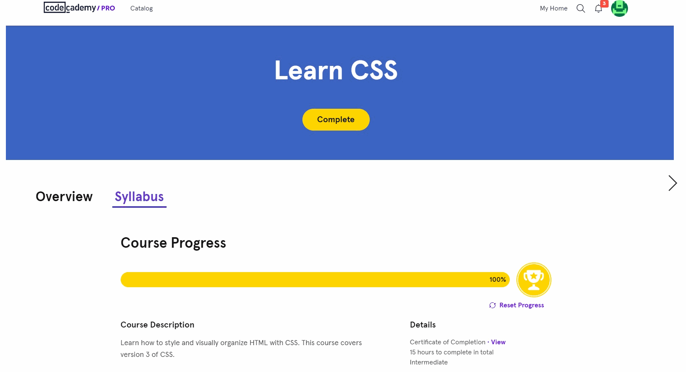
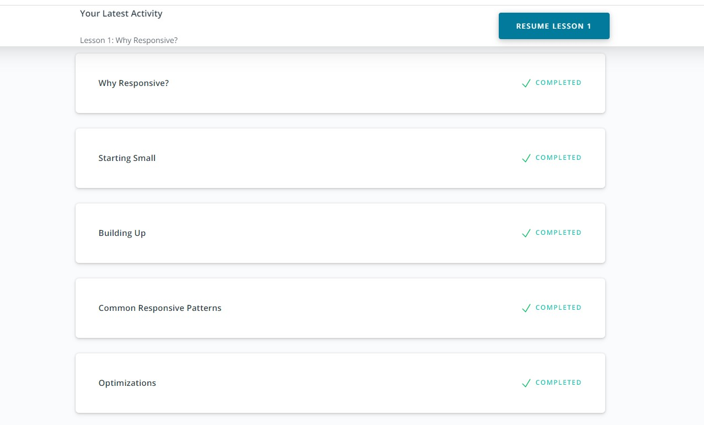
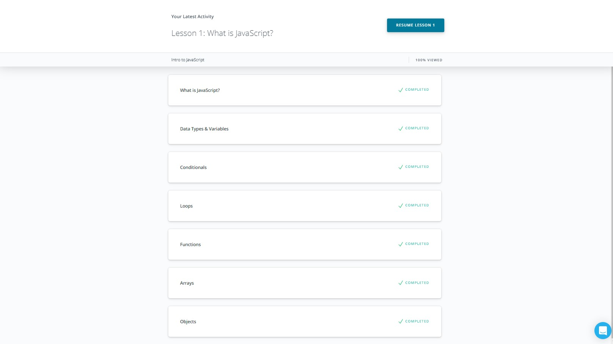
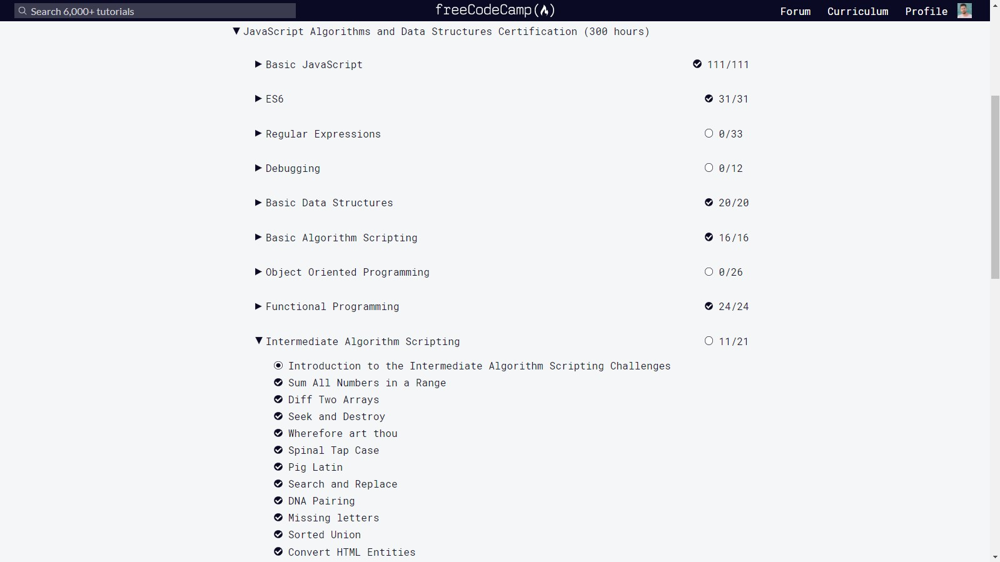
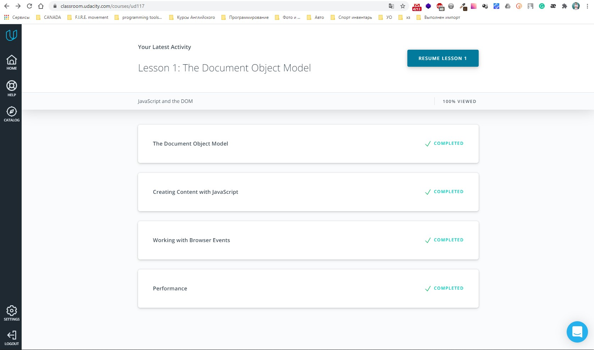
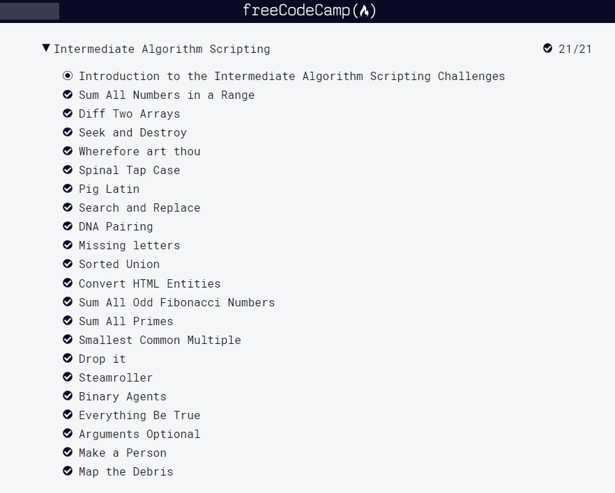

# Front-End Course :mortar_board: from Kottans

This repository :open_file_folder: displays my progress :bicyclist: in taking self-study part of [frontend course](https://github.com/kottans/frontend) from :octocat: [**"Kottans"**](https://kottans.org) development community.

:pushpin: tasks that have been completed:
- :white_check_mark: [Git and GitHub Intro](#git_intro)
- :white_check_mark: [Linux CLI, and HTTP](#linux_cli_http)
- :white_check_mark: [Git Collaboration](#git_collaboration)
- :white_check_mark: [Intro to HTML and CSS](#html_css_intro)
- :white_check_mark: [Responsive Web Design](#responsive_web_design)
- :white_check_mark: [HTML & CSS Practice](#html_css_practice)
- :white_check_mark: [JavaScript Basics](#javascript_basics)
- :white_check_mark: [Document Object Model](#document_object_model)

:pushpin: tasks that are currently being performed:
- :white_large_square: [Building a Tiny JS World](#tiny_js_world)

:pushpin: some additional projects that I run during the course:
- :white_check_mark: [Nickname creator](https://github.com/5Mountains/nickname-creator)

***

## <a name="git_intro">Git and GitHub Intro</a>

:memo: During the course **"Version Control with Git"** and **"try.github.io"** I learned several new commands that I didn't know before and also found new tips to help me in the future.

toggle Screenshot :clapper:

 

 

[:top: back to top](#top)

***

##  <a name="linux_cli_http">Linux CLI, and HTTP</a>

:memo: __Linux Survival__ - definitely pumped up my knowledge on the command line (ls, cs, mkdir, kill, ps, aux) to the next level (mv, pwd, cp, rm, rmdir, find, df, lpr, lpq, lprm, cat), but I certainly should practice it more :hammer: ! 

:memo: **HTTP articles** - extended my knowledge (200, 400 & POST, GET) around status codes as well as verbs. I also discovered more about https and ssl certificates. But, there is no doubt, that I should extra study in order to understand HTTP caching and authentication.  

toggle Screenshot :clapper:

 

 

[:top: back to top](#top)

***

## <a name="git_collaboration">Git Collaboration</a>

:memo: The **"GitHub & Collaboration"** course has certainly improved my understanding of working with forked repositories and , this knowledge will surely be useful in teamwork on the project! I also became more familiar with the CONTRIBUTING.md files.

toggle Screenshot :clapper:

 

 

[:top: back to top](#top)

***

## <a name="html_css_intro">Intro to HTML and CSS</a>

:memo: The **"Intro to HTML and CSS"** course from "udacity" was too easy-peasy task, which I handled very rapidly.

toggle Screenshot :clapper:

 

 

:memo: The **"Learn HTML"** course from "codecademy" was another really easy-breezy task that I did very quickly, despite the fact that I bought "pro" account which allowed me to cover every topic.

toggle Screenshot :clapper:

 

 

The **"Learn CSS"** course from "codecademy" was one more pretty lightweight task that I did quite quickly. Frankly speaking, there was a theme that made me refresh my knowledge and remember everything I had learned before, it was - Grid. So I should do more research :mag: and practice on this topic.

toggle Screenshot :clapper:

 

 

[:top: back to top](#top)

***

## <a name="responsive_web_design">Responsive Web Design</a>

:memo: The **"Responsive Web Design Fundamentals"** course from "udacity" showed me the result of interesting research :bulb: , which I will certainly use in the future :pushpin: , in particular that the average number of characters per line should be about 65, so that people do not skimming text. But other than that, it just refreshed my knowledge about breakpoints and @media :thumbsup:

toggle Screenshot :clapper:

 

 

:memo: The **"Flexbox Froggy"** is "crash course" game which help me to practice CSS Flexbox, was easy task, which I managed pretty fast.

toggle Screenshot :clapper:

 

 

:memo: The **"Grid Garden"** is another "crash course" game which help me to practice CSS Grid, was one more quite easy task, even though last lvls were challenging.

toggle Screenshot :clapper:

 

 

[:top: back to top](#top)

***

## <a name="html_css_practice">HTML & CSS Practice</a>

:memo: Well, **HTML & CSS Practice** was really awesome task in order to complete which I had to make a pop-up menu using only **pure HTML and CSS**, without JS or any other libraries. It was a great practice that definitely made my brain get tense.

Link to code :open_file_folder: of app - [pure html/css popup](https://github.com/5Mountains/popup-kottans)

Link to how the App :mag: like - [pure html/css popup](https://5mountains.github.io/popup-kottans/)

toggle Screenshot :clapper:

 

 

[:top: back to top](#top)

***

## <a name="javascript_basics">JavaScript Basics</a>

:memo: The **Intro to JavaScript** course from "udacity" wasn't something new to me, but nevertheless it gave me the possibility to recall and repeat the fundamental knowledge of JS such as data types & variables, conditionals, loops, functions, arrays and objects as well.

toggle Screenshot :clapper:

 

 

:memo: Well, I will be frank, **freecodecamp**  was not so simple for me as I first thought, its passage took me a couple of days. I had to look at the hint and google in order to come up with the idea of solving problems (especially in the algorithms challenges). There are also several new topics for me, such as recursion or currying, for which I really should do more research and practice in future!

toggle Screenshot :clapper:

 

 

:exclamation::exclamation: While passing one of the challenges, I even managed to find **a bug** :beetle: in the description of the test suites of the task. After that I successfully opened new [issue](https://github.com/freeCodeCamp/freeCodeCamp/issues/40067) in the project repository, and I believe that fixing this bug will improve understanding :point_up: of the task.

toggle Screenshot :clapper:

 

 

[:top: back to top](#top)

***

## <a name="document_object_model">Document Object Model</a>

:memo: The **JavaScript and the DOM** course material from "udacity" was quite well-known to me, but I still highlighted a number of new JS features I didn't know, and took a deeper look at the call stack logic ! The new features I found were cssText; performance.now(); createDocumentFragment();  

toggle Screenshot :clapper:

 

 

:memo: So, one more part of the algorithms from **freecodecamp** was successfully completed. Again, I had to look at the hint and Google :mag:. To be honest, building the logic of an app is not about creating pop-ups or so :)   

toggle Screenshot :clapper:

 

 

:memo: Well, I wouldn't say that **DOM API**  was a difficult task until I started optimizing :twisted_rightwards_arrows: and improving :repeat_one: the code following mentors' recommendations. I think it really gave me a proper understanding of the approach to write ⌨️ eligible code, gratitude a lot! :handshake:

toggle Screenshot :clapper:

 

 

Link to code :open_file_folder: of app - [DOM API task](https://github.com/5Mountains/dom-api-task)

Link to how the App :mag: like - [DOM API task](https://5mountains.github.io/dom-api-task/)

[:top: back to top](#top)

## <a name="tine_js_world">Building a Tiny JS World</a>

Completion of this section is ongoing...

[:top: back to top](#top)
